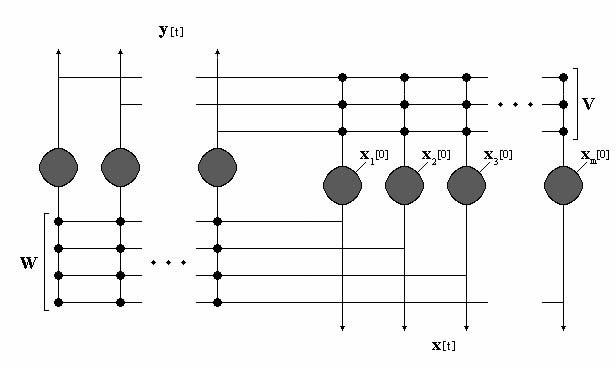

# FEBAM
PyTorch implementation of the paper "FEBAM: A Feature Extracting Bidirectional Associative Memory."

</img>

## Docker Environment
Building image:
```
docker-compose build
```

Starting container/environment:
```
docker-compose up -d
```

Opening a shell in container:
```
docker-compose exec febam bash
```

Instead of opening a shell, you can also go to http://localhost:8888/ to access a Jupyter Lab instance running inside the container.

Stopping container/environment:
```
docker-compose down
```
